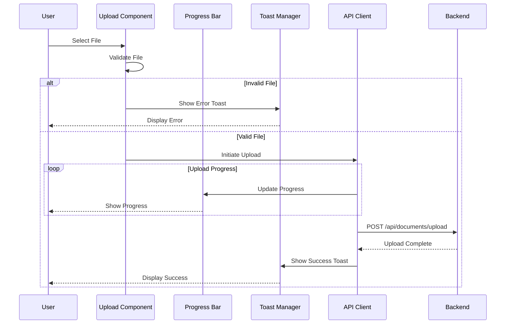
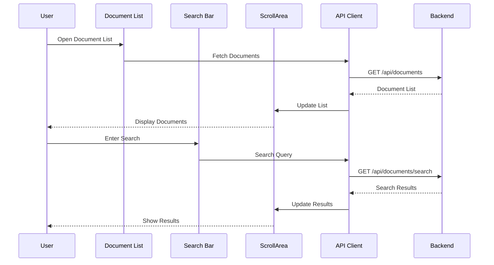

# Insurance Chatbot Frontend

## Executive Summary

This directory contains a modern Next.js application that serves as the user interface for the Insurance Chatbot project. It features a responsive design with advanced UI components for document management, upload progress tracking, and intuitive document browsing.

## Technology Stack

- **Core Framework**:
  - Next.js 15.5.6 with Turbopack
  - React 19.1.0
  - TypeScript for type safety
- **UI Components**:
  - Radix UI primitives
  - Tailwind CSS for styling
  - Custom components for document handling
- **Development Tools**:
  - ESLint for code quality
  - PostCSS for CSS processing
  - Tailwind animations

## Development Setup

### Prerequisites

- Node.js 18 or higher
- npm, pnpm, or yarn
- Backend service running (default: localhost:8000)

### Local Development

```powershell
# Install dependencies
npm install

# Start development server with Turbopack
npm run dev
```

The development server will start at http://localhost:3000 with hot-reload enabled.

### Production Build

```powershell
# Create production build
npm run build

# Start production server
npm run start
```

### Development Features

- Turbopack for faster builds
- Hot module replacement
- TypeScript type checking
- ESLint integration
- CSS auto-prefixing

## Component Architecture

The frontend is organized into several key areas:

```
src/
├── app/               # Next.js App Router pages
│   ├── page.tsx      # Home page
│   └── admin/        # Admin interface
├── components/        # Reusable UI components
│   └── ui/           # Base UI components
└── lib/              # Utilities and actions
```

## UI Components

- **Document Upload**:
  - Progress tracking with `Progress` component
  - Drag-and-drop support
  - File validation
- **Document Browser**:
  - Scrollable document list with `ScrollArea`
  - Responsive card layout
  - Sort and filter capabilities
- **Feedback**:
  - Toast notifications with `sonner`
  - Loading states
  - Error handling

## Environment Configuration

Environment variables can be defined in `.env.local`:

```ini
NEXT_PUBLIC_API_BASE_URL=http://localhost:8000
NEXT_PUBLIC_APP_NAME=Insurance Document Manager
```

## Component Interaction Diagrams

### Document Upload Flow



### Document List and Search Flow



## Change History

### 2025-10-18 - v0.1.0 - FEATURE

**Components Affected**: frontend/components, frontend/app
**Summary**: Enhanced UI with modern components and improved document management
**Details**:

- Added Radix UI components for better accessibility
- Implemented progress tracking for uploads
- Added toast notifications for feedback
- Enhanced document list with virtual scrolling
- Improved error handling and loading states

---

## Troubleshooting

- **API Connection Issues**:
  - Verify backend URL in environment variables
  - Check CORS settings in backend
  - Monitor browser console for errors
- **Upload Problems**:
  - Check file size limits
  - Verify allowed file types
  - Monitor upload progress
- **Performance Issues**:
  - Enable Turbopack for faster development
  - Check browser memory usage
  - Monitor network requests

## Contributing

Please open pull requests for UI changes and update the Change History for significant updates. Ensure components follow the established pattern and include proper TypeScript types.
