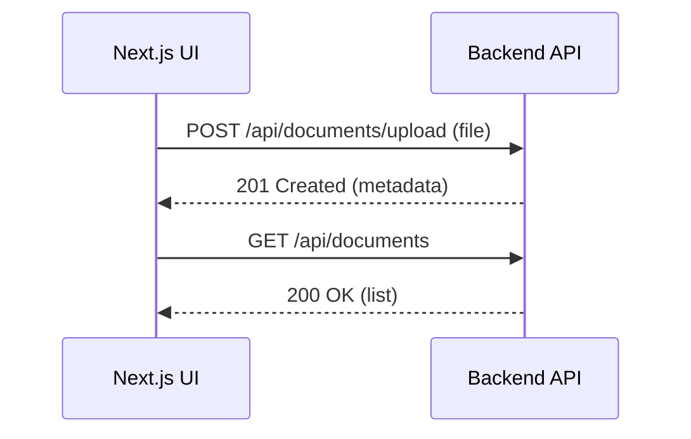

# frontend (Next.js)

Executive summary

This directory contains a Next.js application that serves as the UI for the insurance-chatbot project. It provides pages and components to upload documents and view the document list by talking to the backend API.

## Technology stack

- Next.js (React + TypeScript)
- Tailwind / PostCSS (project includes postcss config)

## Local development

Install dependencies and run the dev server:

```powershell
cd frontend
npm install
npm run dev
```

Open http://localhost:3000 in your browser. The frontend expects the backend API to be available at `http://localhost:8000` (default). If you run the backend on another host/port, update any client-side `actions` or environment variables.

## Build & Production

```powershell
cd frontend
npm run build
npm run start
```

## Environment and configuration

- The frontend is a typical Next.js app; environment variables can be defined via `.env.local`. Example variables you may need:

- NEXT_PUBLIC_API_BASE_URL — base URL for backend API (default: http://localhost:8000)

## Mermaid diagram (frontend <> backend)



## Change History

### 2025-10-18 - v0.1.0 - FEATURE

**Components Affected**: frontend
**Summary**: Expanded frontend README with run/build instructions and diagram.

---

## Troubleshooting

- If the frontend cannot reach the backend, ensure `NEXT_PUBLIC_API_BASE_URL` is set correctly and the backend is running on the expected port.

## Contributing

Please open pull requests for UI changes and update the Change History for significant updates.
